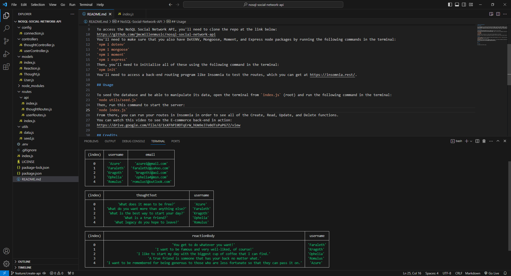
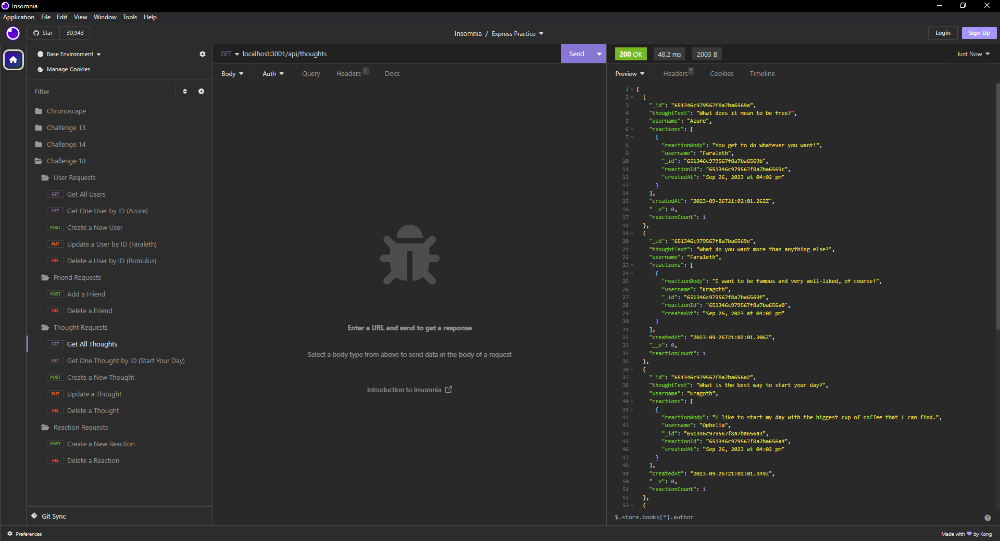

# NoSQL-Social-Network-API

## Description

As a web developer who is leaning more towards back-end development and especially database management, I have discovered a lot of the limitations of SQL and have since researched newer technologies that allow for greater flexibility for all CRUD (create, read, update, and delete) methods in databases. In my research, I discovered MongoDB as a very prominent database management program that allows users to create and manage databases without all of the rigid syntax of SQL. Here, as an example of what MongoDB can do, I've created a back-end API for a fictional social network which allows users to add friends, create thoughts, and add reactions to other users' thoughts.

## Installation

To access the NoSQL Social Network API, you'll need to clone the repo at the link below:
https://github.com/jmcmillenmusic/nosql-social-network-api
You'll need to make sure that you also have DotENV, Mongoose, Moment, and Express node packages by running the following commands in the terminal:
`npm i dotenv`
`npm i mongoose`
`npm i moment`
`npm i express`
Then, you'll need to initialize all of these using the following command in the terminal:
`npm init`
You'll need to access a back-end routing program like Insomnia to test the routes, which you can get at https://insomnia.rest/.

## Usage

To seed the database and be able to manipulate its data, open the terminal from `index.js` (root) and run the following command in the terminal:
`node utils/seed.js`
Then, run this command to start the server:
`node index.js`
From there, you can run your routes in Insomnia in order to see all of the Create, Read, Update, and Delete functions.
You can watch this video to see the E-commerce back-end in action:
https://drive.google.com/file/d/1xXFhPI0DTqErW_hUm9eJ7e0dTsPuPG7Z/view

## Credits

N/A

## License

This project uses the MIT License.